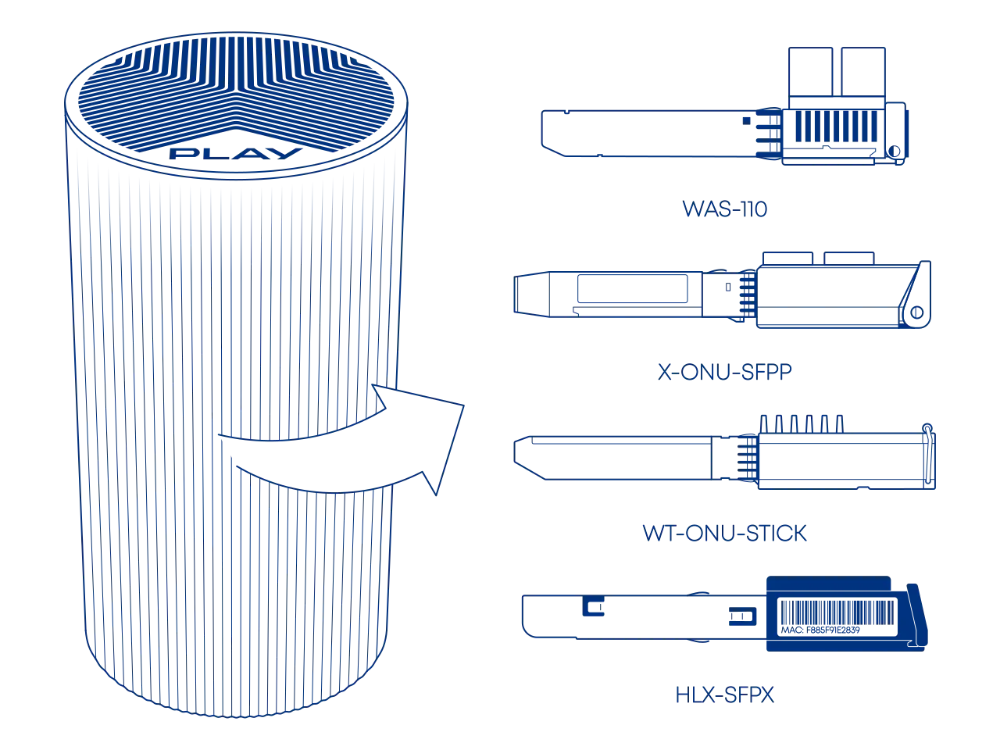
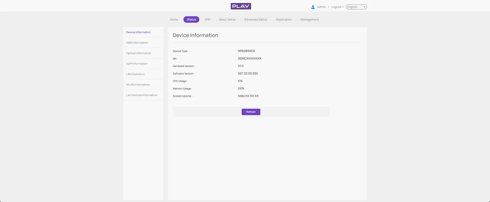
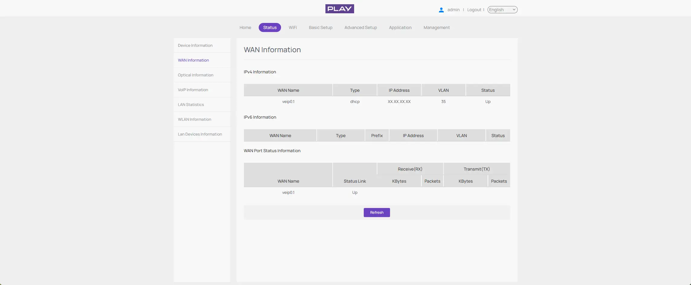

# Masquerade as the Play SDMC NP6089XGS with the WAS-110 or X-ONU-SFPP

{ class="nolightbox" }

<!-- more -->
<!-- nocont -->

!!! warning "Tested footprint"
    This was tested only on PŚO network. Play also uses other wholesale networks and OLT configurations, so VLANs or OMCI requirements may differ elsewhere.

## Purchase a WAS-110 or X-ONU-SFPP

The [WAS-110] and [X-ONU-SFPP] are available from select resellers worldwide. To streamline the process, some resellers
are pre-flashing the 8311 community firmware and highly recommended for the [X-ONU-SFPP]. Purchase at your discretion;
we take no responsibility or liability for the listed resellers.

[WAS-110 Value-Added Resellers](../xgs-pon/ont/bfw-solutions/was-110.md#value-added-resellers)

[X-ONU-SFPP Value-Added Resellers](../xgs-pon/ont/potron-technology/x-onu-sfpp.md#value-added-resellers)

???+ question "Common misconceptions and answers"

    

    

## Requirements

In addition to a [WAS-110] or [X-ONU-SFPP], you will need:

- the PON serial number of the original SDMC gateway;
- the original gateway base MAC address and, preferably, its Internet WAN service MAC;
- a router capable of DHCP/IPoE on VLAN `35` and WAN MAC cloning;
- a way to reach the ONT management address, normally `192.168.11.1/24`.

Follow the [Accessing the ONT](accessing-the-ont.md) guide before continuing.

## Record the subscriber-specific values

<div class="swiper" markdown>

<div class="swiper-slide" step="1" markdown>

{ loading=lazy }

</div>

<div class="swiper-slide" step="2" markdown>

{ loading=lazy }

</div>

</div>

1. Within a web browser, navigate to
   <http://192.168.0.1>
   and sign in to the original SDMC gateway. Then, from **Status**, select **Device Information** and record the
   **Equipment ID** (**Device Type**),
   **Software Version**, and **GPON S/N** (**SN**).

2. From **Status**, select **WAN Information** and record the **VLAN ID** shown in the **VLAN** column.
   Play uses VLAN `35`.

### PON serial number

Record the PON serial shown by the original SDMC web interface or label. It has the form:

```text
SDMCXXXXXXXX
```

The first four characters are the vendor ID. The final eight characters are hexadecimal and must be copied exactly.

### MAC addresses

Record the base MAC printed on the gateway label or shown in its web interface.

??? info "Optional: verify the original SDMC from its shell"
    Root shell access is not required for the replacement because the fixed model attributes are documented below. If shell access is already available, these read-only commands are useful for verification:

    ``` sh
    gponctl getState
    gponctl getSnPwd
    gponctl getOnuId
    gponctl getAllocIds
    gponctl getOmciPort
    ```

    To observe the original DHCP client and its actual service MAC:

    ``` sh
    tcpdump -eni veip0.1 -s0 -vvv -c 8 'udp port 67 or 68'
    ```

## Install the 8311 community firmware

As a prerequisite to masquerading as the SDMC NP6089XGS, the 8311 community firmware is recommended and required for the
remainder of this guide. If you purchased a pre-flashed [WAS-110] or [X-ONU-SFPP], skip past to the [masquerade setup](#masquerade-setup).

=== "WAS-110"

    There are two methods to install the 8311 community firmware onto the [WAS-110], outlined in the following guides:

    __Method 1: <small>recommended</small></h4>__

    :    [Install the 8311 community firmware on the WAS-110](install-the-8311-community-firmware-on-the-was-110.md)

    __Method 2:__

    :    [WAS-110 multicast upgrade and community firmware recovery](was-110-multicast-upgrade-and-community-firmware-recovery.md)

=== "X-ONU-SFPP"

    The [X-ONU-SFPP] 8311 community firmware installation requires a two-step process and is more prone to failure and
    bricking.

    !!! warning "This process is not thoroughly documented and can lead to a bricked device"

    __Step 1: Install the Azores bootloader__

    :    Skip past to the solution in the following [issue tracker](../xgs-pon/ont/potron-technology/8311-uboot.md#solution)
         on how to install the Azores bootloader.

    __Step 2: Multicast upgrade__

    :    Follow through the [WAS-110 multicast upgrade and community firmware recovery](was-110-multicast-upgrade-and-community-firmware-recovery.md)

## Masquerade setup

To successfully masquerade on XGS-PON, the original ONT serial number is mandatory. It, along with other key
identifiers, is available from the web UI or label of the SDMC NP6089XGS.

### from the web UI <small>recommended</small> { #from-the-web-ui data-toc-label="from the web UI"}

??? info "As of version 2.4.0 `https://` is supported and enabled by default"
    All `http://` URLs will redirect to `https://` unless the `8311_https_redirect` environment variable is set to
    0 or false.

<div class="swiper" markdown>

<div class="swiper-slide" markdown>

{ loading=lazy }

</div>

<div class="swiper-slide" markdown>

{ loading=lazy }

</div>

<div class="swiper-slide" markdown>

{ loading=lazy }

</div>

<div class="swiper-slide" markdown>

{ loading=lazy }

</div>

</div>

1. Within a web browser, navigate to
   <https://192.168.11.1/cgi-bin/luci/admin/8311/config>
   and, if asked, input your <em>root</em> password.

2. From the **8311 Configuration** page, on the **PON** tab, fill in the configuration with the following values:

    !!! reminder
        ^^Replace^^ the mandatory **PON serial number**, **Software Versions**, and **IP Host MAC Address**.

    | Attribute                        | Value                       | Mandatory    | Remarks                                            |
    | -------------------------------- | --------------------------- | ------------ | -------------------------------------------------- |
    | PON Serial Number (ONT ID)       | `SDMCXXXXXXXX`              | :check_mark: | Use the subscriber-specific value                  |
    | Equipment ID                     | `NP6089XGS`                 | :check_mark: |                                                    |
    | Hardware Version                 | `NP6089-V1.1`               | :check_mark: | ONU-G version                                      |
    | Sync Circuit Pack Version        | Disabled                    | :check_mark: | Circuit Packs report `HWTC`                        |
    | Software Version A               | `S07.32.03.021`             |              | Inactive image                                     |
    | Software Version B               | `S07.32.03.055`             |              | Active image                                       |
    | Firmware Version Match           | `^(S07\.32\.03\.[0-9]{3})$` |              |                                                    |
    | Override active firmware bank    | `B`                         |              |                                                    |
    | Override committed firmware bank | `B`                         |              |                                                    |
    | OMCC Version                     | `0xA0`                      | :check_mark: |                                                    |
    | OMCI Interoperability Mask       | `18`                        |              | Leave at the normal default unless troubleshooting |
    | Registration ID (HEX)            | `20202020202020202020`      | :check_mark: |                                                    |
    | MIB File                         | `/etc/mibs/prx300_1U.ini`   | :check_mark: | PPTP i.e. default value                            |
    | PON Slot                         | `1`                         | :check_mark: | Produces Ethernet UNI instance `0x0101`            |
    | IP Host MAC Address              | `<BASE-MAC>`                | :check_mark: |                                                    |

3. From the **8311 Configuration** page, on the **ISP Fixes** tab, disable **Fix VLANs** from the drop-down.

4. **Save** changes and _reboot_ from the **System** menu.

### from the shell

1. Login over secure shell (SSH).

    ```sh
    ssh root@192.168.11.1
    ```

2. Configure the 8311 U-Boot environment.

    !!! reminder "Highlighted lines are <ins>mandatory</ins>"
        ^^Replace^^ the mandatory **PON serial number**, **Software Versions**, and **IP Host MAC Address**.

    ```sh hl_lines="1 2 11 12"
    PON_SERIAL='SDMCXXXXXXXX'
    BASE_MAC='AA:BB:CC:DD:EE:FF'

    fwenv_set -8 gpon_sn "$PON_SERIAL"
    fwenv_set -8 equipment_id NP6089XGS
    fwenv_set -8 hw_ver NP6089-V1.1
    fwenv_set -8 cp_hw_ver_sync 0

    fwenv_set -8 iphost_mac "$BASE_MAC"

    fwenv_set -8 sw_verA S07.32.03.021
    fwenv_set -8 sw_verB S07.32.03.055
    fwenv_set -8 -b fw_match '^(S07\.32\.03\.[0-9]{3})$'

    fwenv_set -8 omcc_ver 0xa0
    fwenv_set -8 reg_id_hex 20202020202020202020
    fwenv_set -8 mib_file /etc/mibs/prx300_1U.ini
    fwenv_set -8 pon_slot 1
    fwenv_set -8 fix_vlans 0
    ```

3. Verify the 8311 U-Boot environment and reboot.

    ```sh
    fw_printenv | grep '^8311_'
    reboot
    ```

!!! warning "O5.1 can be a false positive"
    If the ONT reports O5.1 but the VLAN page says `No Extended VLAN Tables Detected`, the OLT has not accepted the full OMCI profile. Do not proceed to router troubleshooting until the service objects exist.

## Verify OLT provisioning

After rebooting the WAS-110 or X-ONU-SFPP, safely remove the SC/APC cable from the SDMC gateway and connect it to the
replacement ONT.

### Check PLOAM status

Open the 8311 overview page and confirm:

```text
PON PLOAM Status: O5.1, Associated state
```

### Check the cloned OMCI identity

From SSH:

```sh
omci_pipe.sh meg 256 0
omci_pipe.sh meg 257 0
omci_pipe.sh meg 7 0
omci_pipe.sh meg 7 1
omci_pipe.sh meg 11 257
```

Expected highlights:

```text
ONU-G vendor:                 SDMC
ONU-G version:                NP6089-V1.1
ONU2-G equipment ID:          NP6089XGS
ONU2-G OMCC version:          0xa0
Software image 0:             S07.32.03.021, valid only
Software image 1:             S07.32.03.055, active + committed + valid
PPTP Ethernet UNI instance:   257 / 0x0101
```

## Configure the router WAN

Configure the router connected to the replacement ONT as follows:

```text
Connection type: DHCP / IPoE
WAN VLAN:        35
WAN MAC clone:   <WAN-MAC> (base + 1)
```

The `IP Host MAC Address` configured on the 8311 does not clone the router's Ethernet MAC. The router must apply its own WAN MAC clone.

## Suppress DHCP Option 61

DHCP Option 61 must be removed from DHCP requests to receive an ACK from the Play DHCP server.

=== ":simple-ubiquiti: UniFi OS"

    The UniFi Network UI does not currently provide a reliable way to express "do not send Option 61". Entering a blank or a space is not equivalent and may prevent the client from sending a valid request.

    A small wrapper can add BusyBox `udhcpc -C` only for the selected Play WAN interface while leaving all other DHCP clients untouched.

    ```sh
    git clone https://github.com/rxri/ubiquiti-dhcp-clientid-removal.git /data/dhcp-clientid-removal
    cd /data/dhcp-clientid-removal
    chmod 755 dhcp-clientid-removal.sh udhcpc-wrapper.sh
    sudo ./dhcp-clientid-removal.sh install
    ```

    The installer creates its user-editable configuration at:

    ```text
    /data/local/etc/dhcp-clientid-removal.conf
    ```

    Set `TARGET_INTERFACE` to the VLAN interface used by the Play WAN, for example:

    ```sh
    TARGET_INTERFACE="eth6.35"
    ```

    The effective MAC address continues to come from the MAC Clone setting in the UniFi UI; it is not stored in the helper configuration.

    ### Reapply after every UniFi OS update

    A UniFi OS firmware update may restore the original `/usr/bin/busybox-legacy/udhcpc` symlink. After every gateway firmware update, rerun the installation:

    ```sh
    cd /data/dhcp-clientid-removal
    git pull --ff-only
    sudo ./dhcp-clientid-removal.sh install
    ```

    If the repository directory no longer exists, clone it to `/data/dhcp-clientid-removal` again and repeat the installation.

    ### Verify the DHCP exchange

    On the UniFi OS gateway:

    ```sh
    tcpdump -eni <WAN-VLAN-INTERFACE> -s0 -vvv 'udp and (port 67 or 68)'
    ```

    The successful exchange should end with:

    ```text
    Discover -> Offer -> Request -> ACK
    ```

    Option 61 must be absent from the Discover and Request packets.

=== ":simple-mikrotik: RouterOS"

    RouterOS includes `clientid` (Option 61) in its [default DHCP client options](https://manual.mikrotik.com/docs/network-management/dhcp/#dhcp-options). Replace `<WAN-INTERFACE>` with the interface used by the Play WAN, then run:

    ``` sh
    /ip dhcp-client set [find where interface="<WAN-INTERFACE>"] dhcp-options=hostname
    /ip dhcp-client renew [find where interface="<WAN-INTERFACE>"]
    ```

    If the DHCP client requires additional custom options, retain them in `dhcp-options` while omitting `clientid`.

## Troubleshooting

| Symptom                                                  | Likely cause                                  | Check                                                               |
| -------------------------------------------------------- | --------------------------------------------- | ------------------------------------------------------------------- |
| Stuck before O5                                          | PON serial, optics, or Registration ID        | Serial format, optical power, Registration ID                       |
| O5.1, but no Extended VLAN table                         | OMCI identity or MIB mismatch                 | `NP6089XGS`, `NP6089-V1.1`, `0xA0`, `prx300_1U.ini`, slot `1`       |
| No Alloc-IDs or data GEMs                                | OLT did not continue provisioning             | Check the VLAN page and OMCI log after ME 287                       |
| GEMs exist, but no DHCP Offer                            | Wrong router VLAN or WAN MAC                  | VLAN `35`, clone the original Internet service MAC                  |
| DHCP Offer followed by NAK on the router                 | DHCP Option 61 still present                  | Verify that the WAN DHCP client does not send Option 61             |

For general optical, PLOAM, and OMCI diagnostics, follow the [Troubleshoot connectivity issues with the WAS-110 or X-ONU-SFPP](troubleshoot-connectivity-issues-with-the-was-110.md) guide.

[WAS-110]: ../xgs-pon/ont/bfw-solutions/was-110.md
[X-ONU-SFPP]: ../xgs-pon/ont/potron-technology/x-onu-sfpp.md
